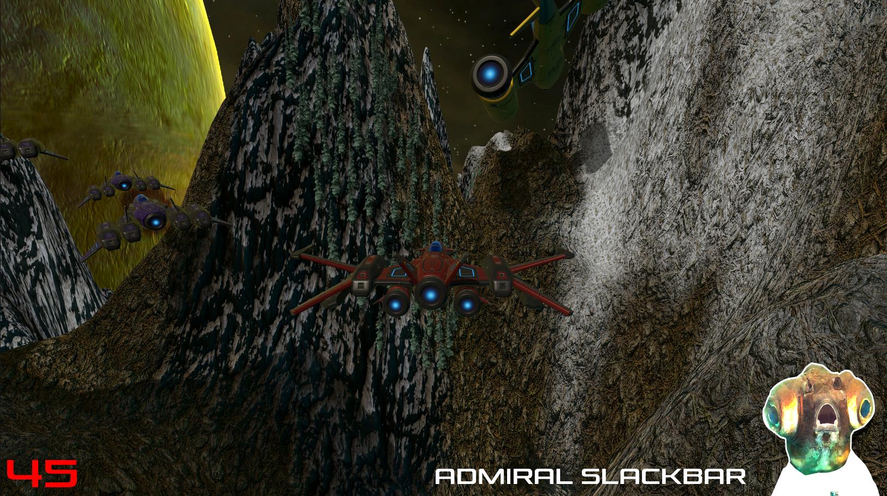

# Space Combat

**Space Combat**은 우주를 배경으로 한 전투 비행 시뮬레이션 게임입니다. 플레이어는 전투기를 조종하여 적의 비행기를 격추하며, 타임라인 기반으로 설계된 다이내믹한 움직임과 전략적인 플레이를 경험할 수 있습니다. 이 프로젝트는 개인 프로젝트로, 지형 설계부터 파티클 이펙트까지 모든 요소가 직접 제작되었습니다.

## 📦 프로젝트 구성

- **플랫폼**: Unity (2022.3.40f1)
- **언어**: C#
- **주요 기능**:
  - 전투기 조종 및 적 비행기 격추
  - 충돌 및 폭발 효과
  - 점수 시스템 및 UI 표시
  - BGM 유지 및 전환

## 🚀 주요 스크립트 설명

### `PlayerController.cs`

플레이어의 전투기를 조종하는 핵심 로직을 포함합니다.

- 이동 속도 및 범위 제어
- 레이저 발사 기능 구현
- 이동과 회전을 자연스럽게 연계

### `CollisionHandler.cs`

플레이어와 장애물의 충돌 이벤트를 처리합니다.

- 충돌 시 폭발 효과 출력
- 일정 시간 후 씬 재시작

### `Enemy.cs`

적 비행기의 동작과 효과를 관리합니다.

- 적이 파괴될 때 점수 반영 및 폭발 효과 생성
- 적의 체력 및 충돌 이벤트 처리

### `ScoreBoard.cs`

게임 점수 시스템을 관리합니다.

- 적을 격추할 때마다 점수를 증가
- UI에 점수를 실시간으로 반영

### `MusicPlayer.cs`

배경 음악을 유지하고 제어합니다.

- 씬 전환 시에도 배경 음악 유지
- 중복 재생 방지를 위한 Singleton 패턴 활용

### `SelfDestruct.cs`

파티클 및 임시 오브젝트의 생명 주기를 관리합니다.

- 일정 시간이 지나면 자동으로 오브젝트 파괴

## 🎮 실행 방법

1. Unity에서 프로젝트를 열고 `Main Scene`을 실행합니다.
2. 키보드와 마우스를 사용하여 전투기를 조종합니다.
   - **이동**: 방향키 또는 WASD
   - **레이저 발사**: 스페이스바

## 🌌 추가 정보

- **지형 설계**: 간단한 우주 배경과 동적인 파티클 효과로 몰입감을 극대화.
- **파티클 이펙트**: 충돌 및 폭발 시 화려한 효과 출력.
- **타임라인 기반 움직임**: 플레이어와 적의 동선을 자연스럽게 설정.

## 📂 파일 구조

- `PlayerController.cs`: 플레이어 조작 및 레이저 발사 구현
- `CollisionHandler.cs`: 충돌 처리 및 게임 리셋 로직
- `Enemy.cs`: 적 비행기 동작 및 효과 관리
- `ScoreBoard.cs`: 점수 관리 및 UI 연동
- `MusicPlayer.cs`: 배경 음악 관리
- `SelfDestruct.cs`: 임시 오브젝트 생명 주기 관리

---

이 프로젝트는 개인 학습 및 Unity 개발 경험을 축적하기 위해 제작되었습니다. 더 자세한 내용이나 개선 사항은 언제든 환영합니다!
